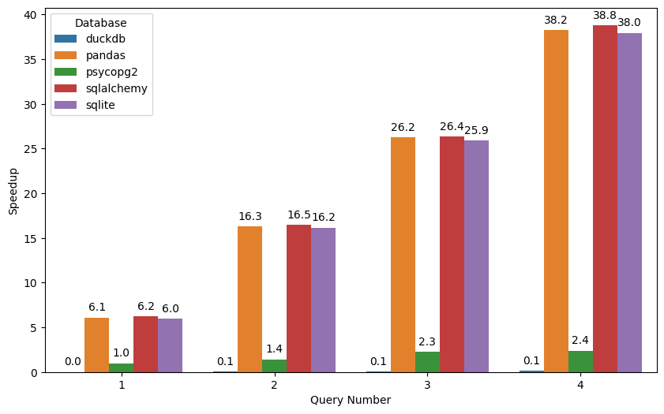
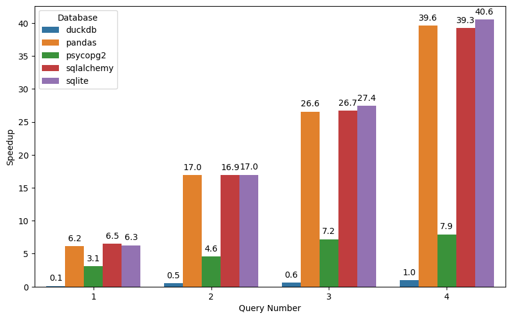
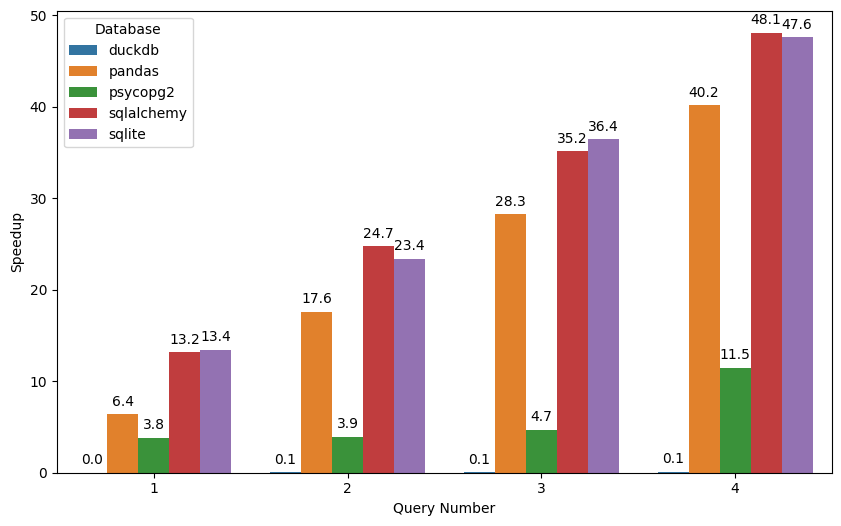

## Оглавление

- [Оглавление](#оглавление)
- [Введение](#введение)
- [1 Краткое описание всех используемых баз данных](#1-краткое-описание-всех-используемых-баз-данных)
  - [1.1 PostgreSQL](#11-postgresql)
  - [1.2 DuckDB](#12-duckdb)
  - [1.3 SQLite](#13-sqlite)
- [2 Используемые библиотеки](#2-используемые-библиотеки)
  - [2.1  psycopg2](#21--psycopg2)
  - [2.2 sqlite3](#22-sqlite3)
  - [2.3 SQLAlchemy](#23-sqlalchemy)
  - [2.4 duckdb](#24-duckdb)
  - [2.5 Pandas](#25-pandas)
- [3 Docker и контейнеры](#3-docker-и-контейнеры)
- [4 Реализация бенчмарка](#4-реализация-бенчмарка)
  - [4.1 Описание бенчмарка](#41-описание-бенчмарка)
  - [4.2 Основной скрипт](#42-основной-скрипт)
  - [4.3 Конфигурационный файл](#43-конфигурационный-файл)
  - [4.4 Описание опыта написания бенчмарка для каждой из библиотек](#44-описание-опыта-написания-бенчмарка-для-каждой-из-библиотек)
- [5 Сравнение удобства реализации каждой из библиотек для работы с СУБД](#5-сравнение-удобства-реализации-каждой-из-библиотек-для-работы-с-субд)
- [6 Результат тестирования](#6-результат-тестирования)
  - [6.1 10G оперативной памяти и 16 потоков процессора](#61-10g-оперативной-памяти-и-16-потоков-процессора)
  - [6.2 10G оперативной памяти и 1 поток процессора](#62-10g-оперативной-памяти-и-1-поток-процессора)
  - [6.3 512M оперативной памяти и 16 потоков процессора](#63-512m-оперативной-памяти-и-16-потоков-процессора)
  - [6.4 Выводы](#64-выводы)
- [7 Инструкция по настройке и запуску](#7-инструкция-по-настройке-и-запуску)
  - [7.1 Docker](#71-docker)
  - [7.2 Windows](#72-windows)
  - [7.3 Linux](#73-linux)
- [Заключение](#заключение)

***

## Введение

В данной работе производится тестирование производительности библиотек для языка программирования Python при работе с данными. Для более удобной автоматизации был использован Docker для того, чтобы разместить все необходимые части. Один контейнер выступает в качестве базы данных PostgreSQL, а второй контейнер отвечает за все остальное тестирование. Конечно, возможно использовать один контейнер для всего, но обычно подразумевается, что база данных PostgreSQL работает удаленно на другом сервере. Остальные базы данных в данной работе являются встраиваемыми базами данных. Это означает, что они могут работать внутри других приложений.

Тестирование производится для четырех запросов к базе данных. Результат тестирования представлен в виде графиков. Также в работе приводится описание всех используемых баз данных и библиотек. В конце работы приводится инструкция по запуску и настройке тестирования.

## 1 Краткое описание всех используемых баз данных

В работе фактически используется три базы данных. Каждую из баз данных будем описывать достаточно однотипно. В начале дается краткое описание, затем приводятся основные характеристики и особенности баз данных в очень краткой форме. В дальнейшем будут затронуты некоторые детали баз данных при сравнении результатов работы всех баз данных.

### 1.1 PostgreSQL

[PostgreSQL](https://www.postgresql.org/) -- это мощная, открытая объектно-реляционная база данных. Данная база данных является достаточно производительной и надежной, а также может использоваться в достаточно сложных инфраструктурах. В некоторых случаях становится хорошим вариантом перехода с платных баз данных Oracle.

СУБД PostgreSQL не является встраиваемой, т.е. для нее обычно требуется отдельный сервер, который обеспечивает работоспособность базы данных. Поддерживает расширения пользователей. Позволяет хорошо масштабировать базу данных, что позволяет ее использовать в крупных и сложных сетях.

### 1.2 DuckDB

[СУБД DuckDB](https://duckdb.org/) -- это встраиваемая аналитическая база данных предназначенная для сложных запросов, которые могут затрагивать большой объем данных. Это означает, что данная база данных хорошо подходит для аналитических целей.

СУБД DuckDB является встраиваемой, позволяет эффективно работать с большими данными. Рассматриваемая СУБД предоставляет высокую скорость работы с большими запросами.

### 1.3 SQLite

[СУБД SQLite](https://www.sqlite.org/) -- является наиболее простой базой данных из рассмотренных. Является встраиваемой, простой и легковесной с ограниченной производительностью.

Рассматриваемая СУБД обладает достаточно низкой производительностью по сравнению с двумя представленными выше базами данных, но при этом она является очень простой и легкой в использовании. Обычно при работе с базами данных подразумевается.

## 2 Используемые библиотеки

В работе используется пять различных библиотек для работы с базами данных. По аналогии с базами данных будет представлена каждая библиотека с кратким описанием.

### 2.1  psycopg2

Библиотека [psycorg2](https://www.psycopg.org) -- это популярный адаптер для языка программирования Python для работы с базой данных PostgreSQL.

### 2.2 sqlite3

Модуль [sqlite3](https://docs.python.org/3/library/sqlite3.html) является встроенным модулем в язык программирования Python для работы с базой данных SQLite.

### 2.3 SQLAlchemy

Библиотека [SQLAlchemy](https://www.sqlalchemy.org/) является ORM к различным базам данных. Данная библиотека предоставляет разработчику возможность работы с базой данных так, словно это некоторый объект языка программирования со своими методами и атрибутами. Может работать со множеством баз данных, но в данном тестировании будет произведено тестирование только с базой данных SQLite.

### 2.4 duckdb

Библиотека [duckdb](https://duckdb.org/docs/api/python/overview) является интерфейсом для работы с базой данных DuckDB

### 2.5 Pandas

Библиотека [Pandas](https://pandas.pydata.org/) является достаточно обширной библиотекой для работы с данными. Поддерживает достаточно методов взаимодействия с данными. Основным объектом, который предоставляет разработчику для управления данными, является `DataFrame`, который является очень эффективным, но требует загрузки всего массива данных в память.

## 3 Docker и контейнеры

Для удобства разворачивания тестирования использовался [Docker](https://www.docker.com/) и docker-compose. Для работы было создано два контейнера. Первый контейнер обеспечивает работу базы данных PostgreSQL второй контейнер обеспечивает работу самого бенчмарка.

Ниже представлен файл `docker-compose.yml`

```yml
version: '2.4'

services:
  postgres:
    image: postgres:latest
    mem_limit: ${MEMORY}
    cpus: ${CPUS}
    environment:
      POSTGRES_USER: ${POSTGRES_USER}
      POSTGRES_PASSWORD: ${POSTGRES_PASSWORD}
      POSTGRES_DB: ${POSTGRES_DB}

    ports:
      - "5432:5432"

  four_bench:
    build:
      context: ./four_bench
    mem_limit: ${MEMORY}
    cpus: ${CPUS}
    volumes:
      - ./four_bench:/app
      - ./data:/data

    environment:
      - POSTGRES_USER=${POSTGRES_USER}
      - POSTGRES_PASSWORD=${POSTGRES_PASSWORD}
      - POSTGRES_DB=${POSTGRES_DB}
      - POSTRGRES_DB_HOST=postgres
      - POSTRGRES_DB_PORT=5432

    depends_on:
      - postgres


```

Все параметры вида `${NAME}` находятся в файле .env. Данный файл конфигурирует только базу данных. Описания конфигурационного файла дается в разделе с [конфигурационным файлом](#43-конфигурационный-файл).

## 4 Реализация бенчмарка

### 4.1 Описание бенчмарка

Бенчмарк производится для каждой библиотеки. Список тестируемых библиотек определеняется [конфигурационным файлом](#43-Конфигурационный-файл). Тестирование производилось для четырех запросов. Каждый запрос определен в конфигурационном файле. Для каждой библиотеки необходимо задавать свой набор запросов. Использование своего набора запросов было необходимым, т.к. некоторые запросы могут быть несовместимы с разными типами баз данных, поэтому их необходимо адаптировать под каждый тип базы данных.

Тестирование выполнялось 10 раз (определяется [конфигурационным файлом](#43-Конфигурационный-файл)). При каждом выполнении запроса выполнялось запись временного промежутка, который требовался для выполнения запроса. Для этого использовался `time.perf_counter`. После сбора всех значений каждого прогона было вычислено медианное значение времени выполнения запроса, которое затем заносилось в файл `result.csv`. Название файла также определяется конфигурационным файлом.

После сбора всех значений для каждого запроса и занесения их в файл был построен график с помощью pandas и seaborn. Каждый запрос определяется Q с нижним индексом, который соответствует номеру запроса. Например, Q1 -- первый запрос.

### 4.2 Основной скрипт

Основной скрипт находится в файле `main.py`. Листинг основного скрипта представлен ниже:

```python
import time
from tqdm import tqdm
import logging
from four_bench.pandasdb_bench import PandasDB
from four_bench.sqlitedb_bench import SQLiteDB
from four_bench.duckdb_bench import DuckDB
from four_bench.sqlalchemydb_bench import SQLAlchemyDB
from four_bench.psycopg2db_bench import PsycopgDB
from four_bench.utils import results_plot
import os
import json
import time

import numpy as np


db_types_converter = {
    "pandas": PandasDB,
    "duckdb": DuckDB,
    "sqlite": SQLiteDB,
    "psycopg2": PsycopgDB,
    "sqlalchemy": SQLAlchemyDB,
}

logger = logging.getLogger("db_bench")
logger.setLevel(logging.INFO)  # Установка общего уровня логирования

# Обработчик для записи в файл
fh = logging.FileHandler("db_bench.log")
fh.setLevel(logging.INFO)
formatter = logging.Formatter("%(asctime)s - %(name)s - %(levelname)s - %(message)s")
fh.setFormatter(formatter)
logger.addHandler(fh)

# Обработчик для вывода в консоль
ch = logging.StreamHandler()
ch.setLevel(logging.INFO)
ch.setFormatter(formatter)
logger.addHandler(ch)


def get_parameters(file: str = "config.json") -> dict:
    """Function for load and return parameters from json file

    Args:
        file (str, optional): file_name or file_path. Defaults to "config.json".

    Returns:
        dict: Ditionary of parameters
    """
    with open(
        os.path.join(os.path.dirname(__file__), file), "r", encoding="utf-8"
    ) as fp:
        parameters = json.load(fp)  # type: dict
    return parameters


def main():
    logger.info("Start Benchmark")

    parameters = get_parameters()

    # Получаем все нужные параметры с помощью метода get
    result_file = parameters.get("result_file", "result.csv") # type: str
    destination_file = parameters.get("destination_file", "result.png") # type: str
    data_file = parameters.get("data_file", None) # type: str
    csv_file = os.path.join(os.path.dirname(__file__), "..", "data", data_file) # type: str
    number_of_trials = parameters.get("number_of_trials", None) # type: int
    test_types = parameters.get("db_types", None) # type: list[str]
    all_queries = parameters.get("sql_queries", None) # type: dict
    

    # Проверяем параметры на существование. Проверяются только обязательные параметры
    if data_file is None:
        logger.error("Data files not found")
        return

    if number_of_trials is None:
        logger.error("You should set up parameter `number_of_trials`")
        return

    if test_types is None:
        logger.error(
            f"You should setup `db_types` parameter. You can setup: {list(db_types_converter.keys())}"
        )
        return
    
    if all_queries is None:
        logger.error(
            f"You shoud setup queries for each type of databas/library"
        )

    logger.info(f"Your tests: {test_types}")


    # Пересоздаем файл с результатами тестов
    # Важно файл сохранять после проведения теста, т.к. иначе
    # он будет просто удален при новом запуске. 
    with open(result_file, "w", encoding="utf-8") as fp:
        fp.write("db,num_of_query,result\n")

    # Получем все базы данных (библиотеки для работы с базами данных)
    # из списка test_types, который является обязательным
    for db in test_types:
        db_name = db
        logger.info("Your sql-queries")
        
        # получаем все запросы из параметров, для конкретной базы данных/библиотеки
        sql_queries = all_queries.get(db_name, None) # type: str
        # Если запросов нет, то выводим ошибку и покидаем функцию
        if sql_queries is None:
            logger.error(f"You should set up sql-queries for {db_name}")
            return

        # Выводим все запросы
        for i, query in enumerate(sql_queries, 1):
            logger.info(f"{i}. {query}")
        # Создаем объект базы данных для каждого из типов
        logger.info(f"Create database {db_name}")
        db = db_types_converter[db](
            csv_file=csv_file, dbname="trips",
        )  # type: PsycopgDB | SQLAlchemyDB | DuckDB | SQLiteDB | PandasDB
        
        # Выполняем каждый запрос
        for query_num, query in enumerate(sql_queries, 1):
            logger.info(f"db: {db_name}, query: {query}")
            trials = []
            for _ in tqdm(range(number_of_trials)):
                start = time.perf_counter()
                db.query(query=query)
                end = time.perf_counter()
                trials.append(end - start)
            result = np.median(trials) # Вычисляем медиану всех времен испытаний
            
            # Сохраняем результаты
            with open(result_file, "a", encoding="utf-8") as fp:
                fp.write(f"{db_name},{query_num},{result}\n")
            logger.info(f"Result {result}")
        del db

    # Строим график 
    results_plot(
        source_file=result_file,
        destination_file=destination_file,
    )


if __name__ == "__main__":
    main()
```

Отметим основную последовательность работы скрипта. Во-первых, производится настройка логирования, т.к. предполагается для работы использовать Docker, то необходимо для вывода информации использовать не стандартные выводы с помощью `print`, а именно с помощью встроенного модуля logging. Данный модуль позволяет выводить данные не только в консоль, но также в файл. В начале файла приводится настройка логирования.

Весь код определен в основной функции  `main`, которая приводит весь цикл тестирования. В самом начале происходит загрузка всех параметров из фаика конфигурации, который является json-файлом. После загрузки параметров происходит проверка некоторых параметров, т.к. они важны для дальнейшего выполнения скрипта.

После этого производится тестирование с помощью создания каждой базы данных и проведения всех запросов, которые определены в файле конфигурации.

### 4.3 Конфигурационный файл

Управление бенчмарком осуществляется через единый конфигурационный файл, в котором определены все необходимые параметры. Все параметры представлены в формате json. Все параметры представлены ниже. Первым параметром является `data_file`, который представляет собой имя файла, который содержит данные. Данный файл должен находиться в папке `data`. Второй параметр `result_file` представляет собой имя файла, в который будут записаны все результаты тестирования. Третий параметр `number_of_trials` определяет количество испытаний для каждого запроса. Четвертый параметр `db_types` определяет список баз данных, которые будут использоваться для тестирования. Пятый параметр `sql_queries` определяет все запросы для каждой базы данных. Последний параметр `create_new_db` определяет, будет ли создаваться новая база данных или будет использоваться уже существующая. Если параметр `create_new_db` установлен в значение `true`, то будет создана новая база данных из файла `data_file`. Если параметр `create_new_db` установлен в значение `false`, то будет использоваться уже существующая база данных. Первый запуск бенчмарка должен быть с параметром `create_new_db` установленным в значение `true`, а все последующие запуски должны быть с параметром `create_new_db` установленным в значение `false`.

```json
{
    "data_file": "nyc_yellow_big.csv",
    "result_file": "results.csv",
    "number_of_trials": 10,
    "db_types": [
        "sqlite",
        "duckdb",
        "psycopg2",
        "sqlalchemy",
        "pandas"
    ],
    "sql_queries": {
        "pandas": [
            "SELECT VendorID, count(*) FROM trips GROUP BY VendorID;",
            "SELECT passenger_count, avg(total_amount) FROM trips GROUP BY 1;",
            "SELECT passenger_count, strftime('%Y', tpep_pickup_datetime) AS pickup_year, count(*) FROM trips GROUP BY 1, 2;",
            "SELECT passenger_count, strftime('%Y', tpep_pickup_datetime) AS year, round(trip_distance), count(*) FROM trips GROUP BY 1, 2, 3 ORDER BY 2, 4 DESC;"
        ],
        "duckdb": [
            "SELECT VendorID, count(*) FROM trips GROUP BY VendorID;",
            "SELECT passenger_count, avg(total_amount) FROM trips GROUP BY 1;",
            "SELECT passenger_count, extract(year from tpep_pickup_datetime), count(*) FROM trips GROUP BY 1, 2;",
            "SELECT passenger_count, extract(year from tpep_pickup_datetime), round(trip_distance), count(*) FROM trips GROUP BY 1, 2, 3 ORDER BY 2, 4 desc;"
        ],
        "sqlite": [
            "SELECT VendorID, count(*) FROM trips GROUP BY VendorID;",
            "SELECT passenger_count, avg(total_amount) FROM trips GROUP BY 1;",
            "SELECT passenger_count, strftime('%Y', tpep_pickup_datetime) AS pickup_year, count(*) FROM trips GROUP BY 1, 2;",
            "SELECT passenger_count, strftime('%Y', tpep_pickup_datetime) AS year, round(trip_distance), count(*) FROM trips GROUP BY 1, 2, 3 ORDER BY 2, 4 DESC;"
        ],
        "psycopg2": [
            "SELECT VendorID, count(*) FROM trips GROUP BY VendorID;",
            "SELECT passenger_count, avg(total_amount) FROM trips GROUP BY 1;",
            "SELECT passenger_count, extract(year from tpep_pickup_datetime), count(*) FROM trips GROUP BY 1, 2;",
            "SELECT passenger_count, extract(year from tpep_pickup_datetime), round(trip_distance), count(*) FROM trips GROUP BY 1, 2, 3 ORDER BY 2, 4 desc;"
        ],
        "sqlalchemy": [
            "SELECT VendorID, count(*) FROM trips GROUP BY VendorID;",
            "SELECT passenger_count, avg(total_amount) FROM trips GROUP BY 1;",
            "SELECT passenger_count, strftime('%Y', tpep_pickup_datetime) AS pickup_year, count(*) FROM trips GROUP BY 1, 2;",
            "SELECT passenger_count, strftime('%Y', tpep_pickup_datetime) AS year, round(trip_distance), count(*) FROM trips GROUP BY 1, 2, 3 ORDER BY 2, 4 DESC;"
        ]
    },
    "create_new_db": false
}
```

Конфигурация docker-compose представлена ниже. В данном файле определены все необходимые параметры для запуска контейнеров. Первые три параметра определяют параметры для базы данных PostgreSQL. Последние два параметра определяют параметры для запуска бенчмарка. Все параметры представлены ниже. Если необходимо произвести подключение к удаленной базе данных без использования контейнера, то необходимо в этом случае изменить параметры `POSTGRES_USER`, `POSTGRES_PASSWORD`, `POSTGRES_DB`, `POSTRGRES_DB_HOST`, `POSTRGRES_DB_PORT` на соответствующие параметры для удаленной базы данных. В данном случае необходимо будет удалить параметр `postgres` из списка `depends_on`.

```conf
POSTGRES_USER=postgres
POSTGRES_PASSWORD=postgres
POSTGRES_DB=trips
MEMORY=10G
CPUS=16
```

> `config.json` находится в папке `four_bench`. `docker-compose.yml` и `.env` находятся в корневой папке.

### 4.4 Описание опыта написания бенчмарка для каждой из библиотек

В данном разделе будет описано, как производилась реализация бенчмарка для каждой из библиотек. Будет рассмотрено, какие особенности были учтены при реализации бенчмарка для каждой из библиотек.

Самой удобной для реализации и для дальнейшей работы была библиотека `duckdb` и соответствующая база данных `DuckDB`. Данная база данных имеет встроенный способ загрузки данных из csv файла. Для этого необходимо использовать специальный запрос.

Также было достаточно легко реализовать работу с базой данных `PostgreSQL` и библиотекой `psycopg2`. Присутствует возможность загрузки данных из csv-файла. Загрузка происходит дольше, но в данном бенчмарке не учитывалось время загрузки данных в базу данных.

Самой неудобной для реализации данного бенчмарка была библиотека `SQLAlchemy`. Все дело в то, что обычно данная библиотека используется для легкой интеграции в работу с различными фреймворками (например Flask). Так как была идея реализовать не просто удобный бенчмарк, но и такой бенчмарк, который можно использовать для других типов данных, то использование удобных стандартных подходов при использовании данной библиотеки при построении классов, который являются таблицами в базе данных, было неудобным. Был использован немного другой способ, который привел к тому, что код для создания и заполнения базы данных слишком сильно разросся.

В работе также использовалась библиотека `sqlite3` для работы с базой данных `SQLite`. Данная библиотека была достаточно удобной для реализации, но отсутствие метода автоматического заполнения данных из файла `csv` вынудило использовать ручное заполнение, которое очень похоже на способ, который использовался для SQLAlchemy.

Самой нелогичной для использования была библиотека `pandas`. Все дело в том, что основная задача библиотеки `pandas` заключается в предоставлении удобного способа работы с данными, которые уже загружены в оперативную память. Использовать данный подход в настоящей работы не было возможности, т.к. объем данных был достаточно большим. Отметим, что перенос данных в файл базы данных был также не самым простым. Если попытаться загрузить все данные из файла `csv`, то библиотека стремилась занять слишком много оперативной памяти. Было решено разбить выгрузку данных на "чанки", т.к. на отдельные куски, которые поочередно загружались. Это позволило снизить потребление оперативной памяти, но привело к более долгой загрузке данных. Очевидно, что данная библиотека просто не предназначена для тех целей, которые проводились в данной работе.

Код все реализаций здесь не приводится, т.к. каждая из библиотек описывается в соответствующем файле в соответствующей папке:

```text
<module_name>_bench/<module_name>db_bench.py
```

здесь `<module_name>` -- это название библиотеки.

## 5 Сравнение удобства реализации каждой из библиотек для работы с СУБД

Так как данная работа направлена на создание бенчмарка для 5 библиотек для взаимодействия с СУБД, было необходимо разработать достаточно общий класс, который был имел одинаковые интерфейсы. Для этого был создан класс `DataBaseForBench`. Листинг представлен ниже.

```python
from abc import abstractmethod, ABCMeta


class DatabaseForBench(metaclass=ABCMeta):
    """
    Abstract class for database
    """

    @abstractmethod
    def __init__(self, **kwargs):
        """
        Initialize database
        :param csv_file: csv file
        :param kwargs: arguments
        """

        # self.kwargs = kwargs

    @abstractmethod
    def create(self):
        """
        Create database
        :return:
        """
        pass

    @abstractmethod
    def close(self):
        """
        Close database
        :return:
        """
        pass

    @abstractmethod
    def query(self, query: str):
        """
        Query database
        :param query: query string
        :return:
        """
        pass

    def __del__(self):
        """
        Delete database
        :return:
        """
        self.close()

```

Данный класс является абстрактным. Все методы классы являются также абстрактными методами. Основной метод для тестирования `query`. Данный метод получает всего один параметр, который является строковым представлением SQL-запроса. Метод `close` позволяет закрыть соединение с базой данных. Для каждой базы данных были реализованы свои методы.

Рассмотрим для начала наиболее эффективные и удобные с точки зрения реализации и скорости выполнения.

**duckdb**

Первым рассмотрим реализацию duckdb.

```python

class DuckDB(DatabaseForBench):
    def __init__(self, **kwargs):
        super().__init__(**kwargs)
        self.csv_file = kwargs.get("csv_file", None)
        self.delimetr = kwargs.get("delimetr", ",")
        self.con = None
        self.cur = None
        self.dbname = kwargs.get('dbname', 'database')
        self.open()

    def open(self):
        self.con = duckdb.connect("duck.db")
        self.cur = self.con.cursor()
        self.cur.execute(
            f"DROP TABLE IF EXISTS {self.dbname}"
        )
        self.cur.execute(
            f"CREATE TABLE {self.dbname} AS SELECT * FROM read_csv_auto('{self.csv_file}', sep='{self.delimetr}')"
        )


    def close(self):
        self.con.close()

    def query(self, query: str):
        return self.cur.execute(query).fetchall()
```

Данные находятся в csv файле, который можно достаточно удобно сразу перенести в базу данных. Для этого необходимо только использовать специальный запрос с указанием расположения файла csv.

## 6 Результат тестирования

Результат тестирования приведен для ограничений ресурсов.

- 10G оперативной памяти и 16 потоков процессора
- 10G оперативной памяти и 1 поток процессора
- 512M оперативной памяти и 16 потоков процессора

### 6.1 10G оперативной памяти и 16 потоков процессора

В данном тестировании самой быстрой оказалась база данных DuckDB с соответствующей библиотекой. Это связано с тем, что данная база данных специально разрабатывалась для выполнения сложных запросов, которые могут охватывать значительную часть данных в таблицах.

Самой медленной оказалась библиотека `SQLAlchemy`, которая имеет близкую к `sqlite` производительность, но немного отстает. Отметим здесь, что это связано с использованием в обоих случаях базы данных `SQLite`. Небольшое отставание производительности можно объяснить тем, что библиотека `SQLAlchemy` призвана предоставить следующий уровень абстракции при работе с базой данных, что может вытекает в более медленные запросы. Стоит добавить, что разница между библиотека минимальная, поэтому ее можно списать на погрешность тестирования.

Стоит также сказать, что библиотека `pandas` находится очень близко по производительности к предыдущим двум библиотекам. Это связано с тем, что данные фактически были сохранены в базу данных `SQLite`, а библиотека `pandas` предоставляет удобный интерфейс для работы с данными, которые уже находятся в оперативной памяти.

Библиотека `psycopg2` с соответствующей базой данных  `PostgreSQL` показали хорошую производительность, которая уступает только `duckdb`. Известно, что база данных `PostgreSQL` является одной из самых популярных баз данных, которая используется в различных проектах. Данная база данных показывает хорошую производительность и при этом может быть легко масштабирована или перенесена на удаленный сервер. Данная база данных является единственной невстраиваемой, т.к. требует использования отдельного сервера для своей работы. В данной работе реализация отдельного сервера производилась с помощью Docker.



### 6.2 10G оперативной памяти и 1 поток процессора

Далее было произведено уменьшения количество потоков процессора до одного, чтобы выяснить, какие из библиотек (баз данных) наиболее чувствительные к количеству ядер процессора.

Можно однозначно сказать, что уменьшение количества потоков повлияло очень сильно на `DuckDB` и `psycopg2`. Это связано с тем, что данные базы данных могут использовать несколько потоков для выполнения запросов. Остальные результаты остались практическими неизменными.



### 6.3 512M оперативной памяти и 16 потоков процессора

Далее было произведено уменьшение оперативной памяти до 512M, чтобы выяснить, какие из библиотек (баз данных) наиболее чувствительные к объему оперативной памяти.
При данном тестировании выяснилось, что такой объем памяти практически не влияет на `DuckDB`. Все остальные библиотеки/базы данных потеряли производительность.


### 6.4 Выводы

Исходя из результатов тестирования можно сделать следующие выводы:

- Библиотека `duckDB` является самой быстрой для выполнения запросов. Это связано с тем, что данная база данных специально разрабатывалась для выполнения сложных запросов, которые могут охватывать значительную часть данных в таблицах.
- Библиотека `psycopg2` с соответствующей базой данных  `PostgreSQL` показали хорошую производительность, которая уступает только `duckdb`. Известно, что база данных `PostgreSQL` является одной из самых популярных баз данных, которая используется в различных проектах.
- Остальные библиотеки/базы данных показали схожую производительность друг с другом, которая уступает `duckdb` и `psycopg2`.



## 7 Инструкция по настройке и запуску

Для начала отметим, что проект удобнее всего запускать в Docker, но так же проект можно запустить в операционной системе `windows` или `linux`.

> Обратите внимание, что для корректной работы с базой данной PostgreSQL ее необходимо запустить в соответствующем контейнере. Если вы производите работу с удаленной базой данных или базой данных, которая локально установлена, то необходимо удалить параметр `postgres` из списка `depends_on` в файле `docker-compose.yml`. Также необходимо изменить параметры `POSTGRES_USER`, `POSTGRES_PASSWORD`, `POSTGRES_DB`, `POSTRGRES_DB_HOST`, `POSTRGRES_DB_PORT` на соответствующие параметры для удаленной базы данных в файле `.env`.

> Ваши исходные `csv` файлы должны быть помещены в папку `data`. Также необходимо разместить название файла в файле конфигурации `config.json` в параметре `data_file`.
>
### 7.1 Docker

Для того, чтобы запускать проект в Docker и использовать docker-compose, необходимо произвести устновку Docker. Способ установки указан в документации для [windows](https://docs.docker.com/desktop/install/windows-install/) и [для других опреационных систем на базе linux](https://docs.docker.com/desktop/install/linux-install/). Запуск всего проекта осуществляется с помощью команды:

```bash
docker-compose up
```

либо с помощь команды:

```bash
docker-compose up -d
```

Во втором случае запуск происходит в фоновом режиме.

Также можно запустить только базу данных.

```bash
docker-compose up postgres
```

или

```bash
docker-compose up -d postgres
```

### 7.2 Windows

Для начала необходимо установить [python версии 3.11](https://www.python.org/downloads/). После этого необходимо с помощью `pip` установить poetry. Для этого необходимо выполнить команду:

```bash
pip install poetry
```

[Poetry](https://python-poetry.org/) -- это менеджер пакетов для языка программирования Python. Данный менеджер позволяет удобно управлять зависимостями проекта. Для того, чтобы установить все зависимости проекта необходимо выполнить команду находясь в директории с `pyproject.toml` (папка `four_bench`):

> Данная и все последующие команды должны выполняться из папки `four_bench`, где находится файл `main.py`.
```bash
poetry install
```

Во время установки будут установлены все необходимые зависимости. После этого необходимо запустить файл `main.py`. Для этого необходимо выполнить команду:

```bash
poetry run python main.py
```

Если `poetry` не вызывается по имени, но был точно установлен, то можно его запускать следующим образом:

```bash
python -m poetry run python main.py
```

### 7.3 Linux

В Linux также необходимо установить python версии 3.11. Для каждой опреационной системы на базе Linux есть свои способы установки. Необходимо обратиться к документации для своей операционной системы или пакетному менеджеру. Также можно собрать [python из исходников](https://devguide.python.org/getting-started/setup-building/). После этого необходимо установить poetry. Для этого необходимо выполнить команду:

```bash
pip install poetry
```

После этого необходимо установить все зависимости. Для этого необходимо выполнить команду находясь в директории с `pyproject.toml` (папка `four_bench`):

```bash
poetry install
```

После этого необходимо запустить файл `main.py`. Для этого необходимо выполнить команду:

```bash
poetry run python main.py
```

Если `poetry` не вызывается по имени, но был точно установлен, то можно его запускать следующим образом:

```bash
python -m poetry run python main.py
```

> Обратите внимание, что во многих операционных системах на базе Linux, если не был добавлен добавлен псевдоним для `python3`, то необходимо использовать команду `python3` вместо `python`. Также необходимо убедиться, что используется версия 3.11. Для этого необходимо выполнить команду `python --version` или `python3 --version`. Если версия не совпадает, то необходимо установить версию 3.11. На других версиях работоспособность возможна, но не гарантируется. Могут быть проблемы при использовании python 3.12.

## Заключение

В данной работе был написан бенчмарк для тестирования пяти библиотек для работы с базами данных. В работе всего было использовано три типа базы данных. Самую лучшую производительность показала библиотека `duckdb` и база данных `DuckDB`, т.к. данная база данных специально предназначается для аналитических запросов, которые могут охватывать значитеьный объем данных. Второй по скорости оказалась библиотека `psycopg2` с базой данных `PostgreSQL`. В данном случае это связано с тем, что сама база данных `PostgreSQL` является достаточно оптимизированной. Отметим, что дополнительно данную базу данных можно настраивать для увеличения производительности, но в данной работе такой цели не было, поэтому вся конфигурация базы данных осталась стандартной. Самый худший результат показали оставшиеся три библиотеки при работе с `SQLite`, т.е. `pandas`, `SQLAlchemy` и `sqlite3`.
